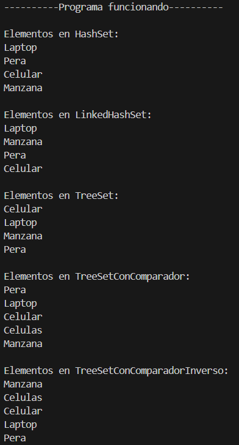

# Práctica de Estructuras de Datos: Set

## 📌 Información General

- **Título:** Práctica de Algoritmos con Set (`HashSet`, `LinkedHashSet`, `TreeSet`)
- **Asignatura:** Estructura de Datos  
- **Carrera:** Computación  
- **Estudiante:** Jaime Loja  
- **Fecha:** 1/07/2025  
- **Profesor:** Ing. Pablo Torres  

---

## 🛠️ Descripción

Este programa implementa y compara diferentes tipos de conjuntos (`Set`) en Java:

- `HashSet`: No garantiza orden.
- `LinkedHashSet`: Mantiene el orden de inserción.
- `TreeSet`: Ordena los elementos por orden natural.
- `TreeSet` con `Comparator`: Ordena por longitud de palabra (y alfabéticamente si hay empate).
- `TreeSet` con `Comparator` inverso: Ordena por longitud descendente (y alfabéticamente inverso si hay empate).

Cada estructura elimina automáticamente los elementos duplicados.

---

## 📦 Estructura del Código

### Clase: `App.java`
Contiene el método principal y cinco métodos auxiliares que imprimen los resultados de cada tipo de conjunto:

- `runHashSet(Sets sets)`
- `runLinkedHashSet(Sets sets)`
- `runTreeSet(Sets sets)`
- `runTreeSetConComparador(Sets sets)`
- `runTreeSetConComparadorInverso(Sets sets)`

### Clase: `Sets.java`
Contiene la lógica para construir cada tipo de conjunto.

#### Métodos:

- `contruirHashSet()`: Devuelve un `HashSet` con valores duplicados que serán eliminados.
- `contruirLinkedHashSet()`: Devuelve un `LinkedHashSet` con orden de inserción.
- `contruirTreeSet()`: Devuelve un `TreeSet` ordenado alfabéticamente.
- `contruirTreeSetConComparador()`: Usa `Comparator` para ordenar por longitud y alfabéticamente en caso de empate.
- `contruirTreeSetConComparadorInverso()`: Usa `Comparator` para ordenar por longitud descendente y alfabéticamente inverso si hay empate.

---

## 🚀 Ejecución

Para compilar y ejecutar el programa, usa los siguientes comandos:

```bash
javac App.java Sets.java
java App
```
## 🧑‍💻 Ejemplo de Entrada 1



## 🧑‍💻 Ejemplo de Entrada 2

